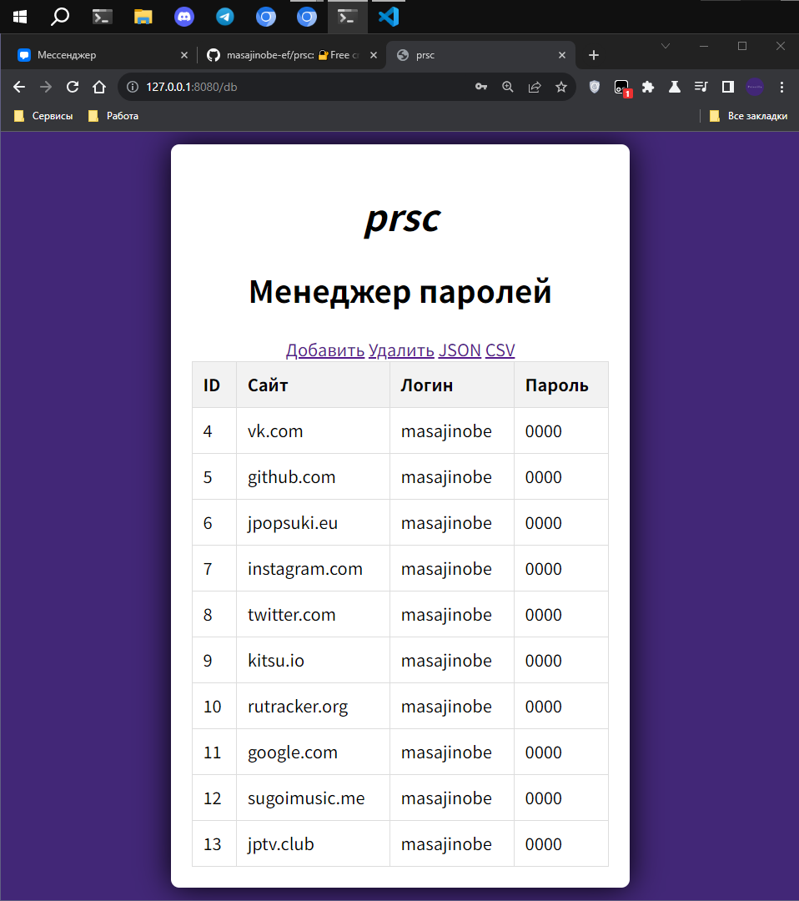

# PRSC: Free Cross-Platform Password Manager

🔐 PRSC is a robust password management application developed using Flask, Python, SQLite, and Cryptography.

This cross-platform solution provides a secure and user-friendly way to store and manage passwords, following the principles of Unix philosophy.



Features:

1. Master-password: Access your password vault securely by master-password.
2. Add Passwords: Easily add and store passwords with detailed information for each entry.
3. Edit and Update: Modify existing password entries as needed, keeping your information up-to-date.
4. Search Functionality: Quickly find specific passwords using the search feature.
5. Security: Cryptography to ensure high level of passwords protection.
6. SQLite Database: Stores password data efficiently and securely using SQLite database.
7. User-Friendly Interface: Prioritizing ease of use, allows convenient view passwords.

## Installation

To get started with PRSC, follow these simple steps:

```bash
$ git clone https://github.com/masajinobe-ef/prsc.git
$ cd prsc
$ pip install -r requirements.txt
$ python prsc.py
Visit http://localhost:8080 in your web browser to access PRSC.
```

### License

This project is licensed under the GPL-3.0 license.
